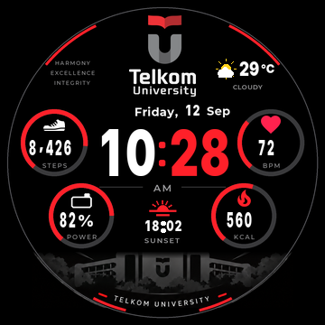
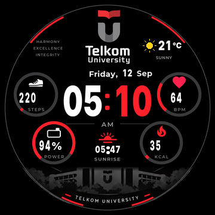
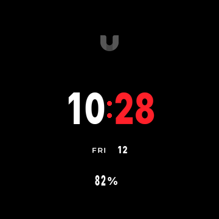
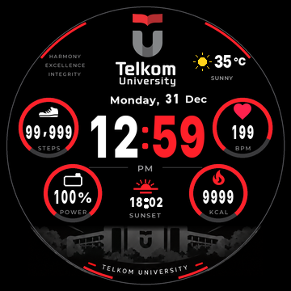

# 🎓 TELKOM UNIVERSITY | Watchface Amazfit T-Rex Pro

Edisi **TELKOM UNIVERSITY** untuk Amazfit T-Rex Pro, dengan ilustrasi kampus,
jam putih-merah, cuaca, waktu matahari, dan empat metrik aktivitas.
Preview v5 sudah diperbaiki dan diperiksa dari hasil ekstraksi `.bin`.
**Versi v5 ini masih menunggu uji di jam.** Hasil uji perangkat sebelumnya
berlaku untuk v4.



## ✨ Kenapa kamu bakal suka

- 🏛️ **Wajah kampus** dengan logo dan ilustrasi kampus Tel-U.
- 🕐 **Jam besar, warna berpasangan** - putih di kiri, merah di kanan.
- ☀️ **Cuaca + jarum matahari:** suhu terkini dan satu penghitung pintar yang
  disiapkan untuk **matahari terbit/terbenam**. Pergantian otomatisnya
  masih perlu diperiksa di perangkat.
- 👟 **Satu layar, semua ritme:** langkah, denyut jantung, kalori, dan baterai
  dalam cincin-cincin rapi.
- 🌙 **Always-on nanggung? Nggak.** Jam, hari, tanggal, dan baterai tetap
  tampil tanpa bikin panel utama "teriak-teriak".
- 🔋 **Ramah AMOLED:** hitam pekat bikin layar hemat tenaga.
- ⚪ **Aman di layar bulat:** semua elemen sudah dihitung supaya nggak
  kepotong bezel. Validator tambahan menolak tabrakan antarelemen.

## 🖼️ Galeri tampilan

| Siang hari ☀️ | Matahari terbit 🌅 |
| :---: | :---: |
|  |  |

| Always-on 🌙 | Data maksimum 💪 |
| :---: | :---: |
|  |  |

*Semua gambar adalah render dari isi file `.bin` yang sudah diverifikasi
(simulasi), bukan foto jam - biar kamu bisa lihat semua skenario tampilan
sebelum pasang.*

## 📲 Cara pasang (5 menit, gampang!)

1. **Unduh** file
   [`out/telu_trex_pro.bin`](out/telu_trex_pro.bin) (klik **Download** di
   halaman file itu). Alias dengan nama produk ada di
   [`out/telu_university_v5.bin`](out/telu_university_v5.bin).
2. Siapkan **AmazFaces** di HP, pastikan jam tersambung, lalu pilih perangkat
   **Amazfit T-Rex Pro** (360 x 360).
3. Buka menu **Add file / file lokal** di AmazFaces, lalu pilih file `.bin`
   tadi. Nama menu bisa berbeda tergantung versi aplikasi.
4. Ikuti proses instalasi sampai selesai, lalu aktifkan **TELKOM UNIVERSITY**
   dari daftar watchface di jam kamu. 🎓
5. Kalau bingung, panduan lengkap ada di
   [`docs/build-install.md`](docs/build-install.md).

> ⚠️ Ini format legacy **UIHH v2** khusus T-Rex Pro, bukan paket Zepp OS.
> Jangan pilih model T-Rex biasa ya, nanti gagal.

## 🧰 Buat yang hobi ngoprek

Watchface ini dibangun dari nol pakai Python, tanpa SDK Zepp. Semua script ada
di `tools/`:

```powershell
python tools/build_all.py
python -m unittest discover -s tools -p "test_*.py"
```

- `tools/gen_telu.py`: generator aset dan parameter layout (latar diekstrak
  dari ilustrasi kampus; cincin, ikon, dan angka disusun di latar bersih).
- `tools/check_round.py`: penjaga lingkaran - build gagal kalau ada elemen
  keluar dari radius layar.
- `tools/check_layout.py`: memeriksa tabrakan angka, label, ikon, dan latar
  pada semua varian sprite serta memastikan angka tetap di dalam cincin.
- `tools/pack_watchface.py`: packer `.bin` UIHH v2 dengan kompresi ala file
  asli.
- `tools/verify_bin.py`: verifikasi hasil build (kompresi, header, parameter,
  dan piksel round-trip).
- `tools/render_mockup.py`: simulator tampilan dari isi `.bin`, dipakai untuk
  semua gambar di atas.
- `preview.html`: halaman preview interaktif dengan pilihan skenario.
- [`docs/compatibility-fix-v4.md`](docs/compatibility-fix-v4.md): catatan
  teknis lengkap uji di perangkat (masih relevan untuk semua edisi).
- [`docs/v5-format-notes.md`](docs/v5-format-notes.md): catatan riset format
  untuk cuaca, matahari, dan nama bulan.
- `out/validation.json`: ukuran, SHA-256, dan hasil validasi build terakhir.
- [`docs/layout-repair-v5.md`](docs/layout-repair-v5.md): penyebab tumpukan,
  perbaikan, dan hasil pengujian layout.

## 📅 Riwayat singkat

| Revisi | Kabar |
| :--- | :--- |
| **v5** (12 Sep 2026) | 🎓 Edisi **TELKOM UNIVERSITY**: wajah kampus, modul cuaca + matahari terbit/terbenam, empat cincin metrik, dan always-on ringkas. |
| v4 (12 Sep 2026) | ✅ Berjalan di jam. Warna merah diperbaiki, posisi jam terkunci, always-on sama dengan tampilan utama. |
| v3 | Perbaikan referensi gambar (ID mulai 1), watchface muncul di koleksi jam. |
| v2 | Percobaan pertama, preview hitam, belum berhasil. |

## 💜 Kredit & catatan

- Font [Montserrat](https://fonts.google.com/specimen/Montserrat) dan
  [Inter](https://fonts.google.com/specimen/Inter) dari Google Fonts (lisensi
  OFL).
- Logo resmi Telkom University dari
  [Wikimedia Commons](https://commons.wikimedia.org/wiki/File:Telkom_University_logo.svg),
  karya Hilfans, lisensi CC BY-SA 4.0 - dipakai dengan penghormatan untuk
  keperluan personal.
- Ikon Material Design Icons (Pictogrammers) untuk sepatu, hati, api, dan
  baterai.
- Format file dan skema parameter mengacu ke proyek
  [watchface-js](https://github.com/Nadeflore/watchface-js) oleh Nadeflore
  (GPL-3.0), dengan implementasi packer sendiri.
- Warna mengikuti
  [palet resmi Telkom University](https://it.telkomuniversity.ac.id/kode-warna-logo-telkom-university/).
- Dibuat oleh [@fathahnoor](https://github.com/fathahnoor), periset aktif di
  Fakultas Ilmu Terapan, Telkom University. 👋
- Proyek personal non-komersial. **Bukan produk resmi Telkom University**, ya.

**Selamat bergaya, Telyutizen!** Jangan lupa pamer ke teman sekelas. 🎓💜
