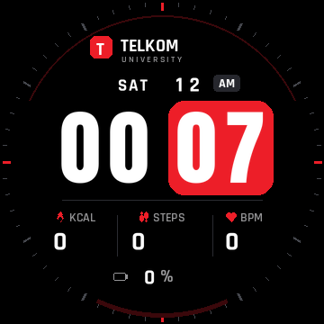

# 🔴 TEL-U REDLINE | Watchface Amazfit T-Rex Pro

**Bawa identitas Telkom University ke pergelangan tanganmu!** 👋⌚
Halo Telyutizen! TEL-U REDLINE adalah watchface untuk **Amazfit T-Rex Pro**
(layar bulat 360 x 360) dengan merah khas Tel-U, angka jam super besar, dan
info harian lengkap. Sudah jalan mulus di jam sungguhan. 🔥


## ✨ Kenapa kamu bakal suka

- 🔴 **Merah khas Tel-U** di kapsul menit, chip brand, dan aksen dial.
- 🕐 **Jam besar banget**, sekali lirik langsung kebaca.
- 📊 **Info lengkap dalam satu layar:** hari, tanggal, AM/PM, kalori, langkah,
  denyut jantung, dan baterai.
- 🌙 **Always-on nggak nanggung:** semua info tetap tampil, bukan cuma jam.
- 🔋 **Ramah AMOLED:** latar hitam pekat, pixel benar-benar mati, baterai lebih awet.
- ✅ **Aman di layar bulat:** semua elemen sudah dihitung agar tidak kepotong bezel.

## 📸 Galeri tampilan

| Siang hari 🔥 | Always-on 🌙 |
| :---: | :---: |
|  |  |

| Data maksimum 🔝 | Tengah malam 🌚 |
| :---: | :---: |
|  |  |

*Gambar di atas adalah render dari isi file `.bin` (simulasi), bukan foto jam,
supaya kamu bisa lihat semua skenario tampilan.*

## 📥 Cara pasang (5 menit, gampang!)

1. **Unduh** file [`out/telu_redline_compat_v4.bin`](out/telu_redline_compat_v4.bin)
   (klik tombol **Download** di halaman file itu).
2. Siapkan **AmazFaces** di HP, pastikan jam tersambung, lalu pilih perangkat
   **Amazfit T-Rex Pro** (360 x 360).
3. Buka menu **Add file / file lokal** di AmazFaces, lalu pilih file `.bin`
   tadi. Nama menu bisa berbeda tergantung versi aplikasi.
4. Ikuti proses instalasi sampai selesai, lalu aktifkan TEL-U REDLINE dari
   daftar watchface jam kamu. ✅
5. Kalau bingung, panduan lengkap ada di [`docs/build-install.md`](docs/build-install.md).

> 💡 Ini format legacy UIHH v2 khusus T-Rex Pro, bukan paket Zepp OS.
> Jangan pilih model T-Rex biasa ya, nanti gagal.

## 🛠️ Buat yang hobi ngoprek

Watchface ini dibangun dari nol pakai Python, tanpa SDK Zepp. Semua script ada
di `tools/`:

```powershell
python tools/build_all.py
python -m unittest discover -s tools -p "test_*.py"
```

- `tools/gen_telu.py`: generator aset dan parameter layout.
- `tools/pack_watchface.py`: packer `.bin` UIHH v2 dengan kompresi ala file asli.
- `tools/verify_bin.py`: verifikasi hasil build (kompresi, header, dan piksel).
- `preview.html`: halaman preview interaktif dengan pilihan skenario.
- `docs/compatibility-fix-v4.md`: catatan teknis lengkap uji di perangkat.
- `out/validation.json`: ukuran, SHA-256, dan hasil validasi build terakhir.

## 🗒️ Riwayat singkat

| Revisi | Kabar |
| :--- | :--- |
| **v4** (12 Sep 2026) | ✅ Berjalan di jam. Warna merah diperbaiki, posisi jam terkunci, always-on sama dengan tampilan utama. |
| v3 | Perbaikan referensi gambar (ID mulai 1), watchface muncul di koleksi jam. |
| v2 | Percobaan pertama, preview hitam, belum berhasil. |

## 🙏 Kredit & catatan

- Font [Anton](https://fonts.google.com/specimen/Anton) dan
  [Rajdhani](https://fonts.google.com/specimen/Rajdhani) dari Google Fonts
  (lisensi OFL).
- Format file dan skema parameter mengacu ke proyek
  [watchface-js](https://github.com/Nadeflore/watchface-js) oleh Nadeflore
  (GPL-3.0), dengan implementasi packer sendiri.
- Warna mengikuti
  [palet resmi Telkom University](https://it.telkomuniversity.ac.id/kode-warna-logo-telkom-university/).
- Dibuat oleh [@fathahnoor](https://github.com/fathahnoor), periset aktif di
  Fakultas Ilmu Terapan, Telkom University. 💙
- Proyek personal non-komersial. Bukan produk resmi Telkom University, ya.

**Selamat bergaya, Telyutizen!** Jangan lupa pamer ke teman sekelas. 😎🔴
