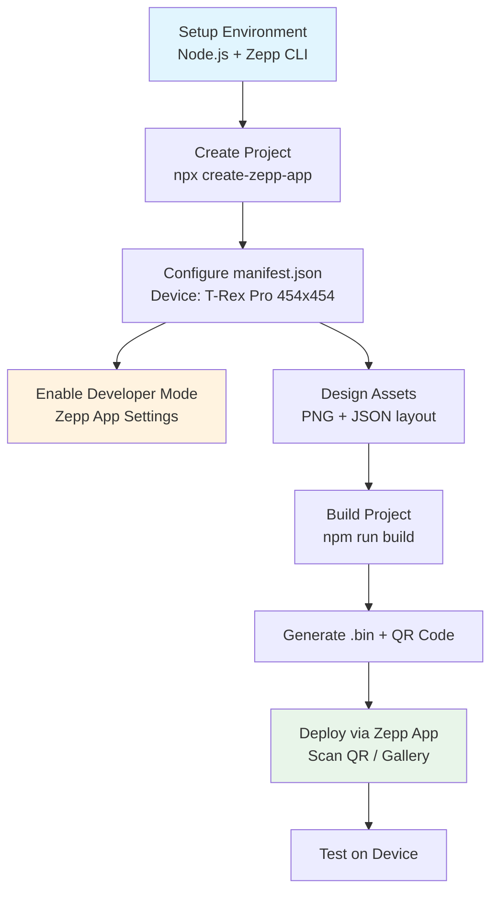

# Panduan Pembuatan Watch Face Amazfit T-Rex Pro (Zepp OS)

## Ringkasan Eksekutif

Amazfit T-Rex Pro menggunakan **Zepp OS** dengan resolusi layar **454×454 piksel** (layar AMOLED 1,39 inci). Pengembangan watch face dilakukan melalui **Zepp OS SDK** dengan alur: setup environment → buat project → desain → build → deploy via QR code.

---

## 1. Spesifikasi Teknis T-Rex Pro

| Parameter | Nilai |
|-----------|-------|
| **Platform** | Zepp OS (RTOS-based) |
| **Resolusi** | 454 × 454 piksel |
| **Tipe Layar** | AMOLED, 326 PPI |
| **Format Output** | `.bin` (binary watch face) |
| **Developer Mode** | Required (via Zepp App) |
| **Metode Install** | QR Code / Zepp App Developer Options |

---

## 2. Alur Lengkap (Workflow)



---

## 3. Setup Environment Development

### 3.1 Prerequisites

```bash
# Cek Node.js (minimal v16+)
node --version
npm --version
```

### 3.2 Install Zepp CLI

```bash
# Install Zepp OS CLI tool globally
npm install -g @zeppos/cli

# Atau gunakan npx langsung (recommended untuk agent)
npx @zeppos/cli create-zepp-app
```

### 3.3 Buat Project Watch Face

```bash
# Buat project baru dengan template watchface
npx @zeppos/cli create-zepp-app my-trex-watchface --template watchface

# Struktur folder yang dihasilkan:
my-trex-watchface/
├── src/
│   ├── index.js          # Entry point watch face
│   └── styles/           # CSS/stylesheet (jika ada)
├── assets/
│   ├── images/           # PNG assets (background, icons, numbers)
│   └── fonts/            # Custom fonts (.ttf/.otf)
├── manifest.json         # Konfigurasi device & permissions
├── package.json
└── zepp.config.js        # Build configuration
```

---

## 4. Konfigurasi manifest.json (Critical)

File `manifest.json` menentukan kompatibilitas device. Untuk T-Rex Pro:

```json
{
  "manifestVersion": 1,
  "type": "watchface",
  "name": "My T-Rex Pro WF",
  "version": "1.0.0",
  "description": "Custom watch face for Amazfit T-Rex Pro",
  "icon": "assets/images/icon.png",
  "main": "src/index.js",
  "platforms": ["zepp-os"],
  "deviceTypes": ["t-rex-pro"],
  "resolution": {
    "width": 454,
    "height": 454
  },
  "apiVersion": "4.2",
  "permissions": [
    "sensor:heart-rate",
    "sensor:steps",
    "sensor:battery",
    "system:time"
  ],
  "runtime": {
    "apiVersion": "4.2"
  }
}
```

**Catatan:**
- Device type `t-rex-pro` atau gunakan `deviceBasicInformation` dari docs.zepp.com untuk mapping resmi. [docs.zepp](https://docs.zepp.com/)
- API Level 4.2 adalah versi stabil terkini (2025-2026). [docs.zepp](https://docs.zepp.com/)

---

## 5. Desain & Asset Preparation

### 5.1 Spesifikasi Asset

| Asset Type | Format | Ukuran Max | Naming Convention |
|------------|--------|------------|-----------------|
| Background | PNG | 454×454 | `bg_001.png`, `bg_002.png` |
| Numbers (0-9) | PNG | 60×80 max | `0.png`, `1.png`, ... `9.png` |
| Icons | PNG | 48×48 | `heart.png`, `steps.png`, `battery.png` |
| Fonts | TTF/OTF | - | `custom_font.ttf` |

### 5.2 Tools Rekomendasi

- **Figma** + Zepp Watchface Plugin (untuk layout visual) [facebook](https://www.facebook.com/groups/686993160641321/posts/823268120347157/)
- **Watch Face Editor (ZeppOS)** - Windows app dari Microsoft Store [apps.microsoft](https://apps.microsoft.com/detail/xp89mr7pjvt9q9?hl=en-US&gl=IS)
- **Amazfit Watchface Editor** - Android app (no-code) [play.google](https://play.google.com/store/apps/details?id=paolo4c.zepp.wfeditor&hl=en_US)
- **Pixlr** / **Photopea** - Edit PNG online
- **WatchFace.exe** (dari repo YueErro) - Convert JSON ↔ BIN untuk legacy workflow [github](https://github.com/YueErro/amazfitBip_watchface)

---

## 6. Build & Generate .bin

### 6.1 Build Command

```bash
cd my-trex-watchface

# Install dependencies
npm install

# Build project (generate .bin)
npm run build

# Output: dist/watchface.bin (atau similar)
```

### 6.2 Generate QR Code (Opsional)

Beberapa CLI tool otomatis generate QR code untuk deploy:

```bash
# Jika menggunakan Zepp CLI dengan QR support
npx @zeppos/cli deploy --qr

# Atau gunakan tool pihak ketiga:
# - Watchdrip (untuk miniprogram + watchface)
# - SashaCX75 Watch Face Editor (Windows)
```

---

## 7. Deploy ke Device (T-Rex Pro)

### 7.1 Enable Developer Mode di Zepp App [youtube](https://www.youtube.com/watch?v=u76_oYfY9Ts)

1. Buka **Zepp App** → **Profile** → **Settings** → **About**
2. Tap **Zepp Logo** 5-7 kali hingga muncul: _"Developer mode activated"_
3. Kembali ke **Profile** → pilih device **T-Rex Pro** → **General** → **Developer Mode**
4. Pilih **Watch Face** → **+** (tambah watch face)

### 7.2 Install via QR Code

**Metode A: Scan Langsung**
1. Di Zepp App → Developer Mode → Watch Face → **+** → **Scan QR**
2. Scan QR code yang digenerate dari build tool
3. Watch face otomatis terinstall

**Metode B: Via Gallery (Screenshot QR)**
1. Screenshot QR code ke gallery HP
2. Di Zepp App → Developer Mode → Watch Face → **+** → **Gallery**
3. Pilih gambar QR code dari gallery [youtube](https://www.youtube.com/watch?v=eKyvGmpvsN4)

### 7.3 Alternatif: Install via .bin File (Legacy)

Untuk metode manual tanpa QR (jika tool tidak support):

1. Copy file `.bin` + preview `.png` ke folder:
   ```
   Android/data/com.huami.watch.hmwatchmanager/files/watch_skin_local/
   ```
2. Rename file `.bin` Anda dengan nama file yang sama seperti watch face default
3. Sync via Zepp App → Watch Faces → Local

---

## 8. Testing & Debugging

### 8.1 Simulator (Jika Tersedia)

Zepp OS menyediakan simulator untuk testing tanpa device fisik:

```bash
# Jalankan simulator (jika tersedia di CLI)
npx @zeppos/cli simulate
```

**Catatan:** Tidak semua device support simulator. T-Rex Pro mungkin perlu testing langsung di device. [developer.zepp](https://developer.zepp.com/os/2025/global-online-hackathon)

### 8.2 Checklist Testing

- [ ] Tampilan sesuai di layar 454×454 (tidak crop/overflow)
- [ ] Widget data real-time (jam, tanggal, heart rate, steps, battery) berfungsi
- [ ] Always-On Display (AOD) mode (jika diimplementasi)
- [ ] Konsumsi baterai reasonable (test 24-48 jam)
- [ ] Kompatibilitas Zepp OS version di T-Rex Pro (cek di Settings → About)

---

## 9. Referensi & Resources

### 9.1 Dokumentasi Resmi

- **Zepp OS Docs:** [https://docs.zepp.com/](https://docs.zepp.com/)
- **Device Basic Info:** [https://docs.zepp.com/docs/reference/device-app-api/newAPI/deviceBasicInformation/](https://docs.zepp.com/docs/reference/device-app-api/newAPI/deviceBasicInformation/)
- **Developer Community:** Discord Zepp OS ([https://zeppos.dev/discord](https://zeppos.dev/discord)) [developer.zepp](https://developer.zepp.com/os/2025/global-online-hackathon)

### 9.2 Tools & Komunitas

| Tool | Platform | Link |
|------|----------|------|
| **Watch Face Editor (ZeppOS)** | Windows | Microsoft Store [apps.microsoft](https://apps.microsoft.com/detail/xp89mr7pjvt9q9?hl=en-US&gl=IS) |
| **Amazfit Watchface Editor** | Android | Google Play [play.google](https://play.google.com/store/apps/details?id=paolo4c.zepp.wfeditor&hl=en_US) |
| **SashaCX75 Editor** | Windows | GitHub [reddit](https://www.reddit.com/r/amazfit/comments/1qybgyu/great_app_for_creating_your_own_designs/) |
| **amazfitwatchfaces.com** | Web | Katalog + forum [amazfitwatchfaces](https://amazfitwatchfaces.com/) |
| **WatchFace.exe (Legacy)** | Windows | GitHub YueErro [github](https://github.com/YueErro/amazfitBip_watchface) |

### 9.3 Contoh Project

- **YueErro/amazfitBip_watchface** - Tutorial + tools legacy (BIP, tapi konsep JSON serupa) [github](https://github.com/YueErro/amazfitBip_watchface)
- **Zepp OS Sample Templates** - Via CLI `create-zepp-app --template watchface`

---

## 10. Prompt untuk Coding Agent Harness

Berikut template prompt yang dapat Anda gunakan:

```markdown
## Task: Build Watch Face for Amazfit T-Rex Pro (Zepp OS)

**Device Specs:**
- Platform: Zepp OS API 4.2
- Resolution: 454×454 AMOLED
- Output: .bin file

**Requirements:**
1. Create Zepp OS watchface project using `npx @zeppos/cli create-zepp-app`
2. Configure manifest.json with device type "t-rex-pro" and API 4.2
3. Design watchface with:
   - Background: [describe/attach]
   - Time display: [analog/digital, position]
   - Complications: date, steps, heart rate, battery
4. Build with `npm run build` → generate .bin
5. Generate QR code for deployment

**Assets Provided:**
- [Attach PNG files / describe design]

**Output Expected:**
- Complete project folder structure
- Built .bin file
- QR code image (if supported)
- Installation instructions for T-Rex Pro

**References:**
- https://docs.zepp.com/
- https://amazfitwatchfaces.com/
```

---

## Catatan Penting & Caveats

1. **Zepp OS Tertutup:** Tidak ada SDK publik selengkap Wear OS. Dokumentasi terbatas dan beberapa fitur hanya tersedia via Zepp internal tools. [docs.zepp](https://docs.zepp.com/)

2. **API Level:** Pastikan menggunakan API 4.2+ untuk kompatibilitas T-Rex Pro (Zepp OS 3.x+). [docs.zepp](https://docs.zepp.com/)

3. **Alternative No-Code:** Jika development terlalu kompleks, gunakan **Amazfit Watchface Editor** (Android) untuk desain visual tanpa coding. [play.google](https://play.google.com/store/apps/details?id=paolo4c.zepp.wfeditor&hl=en_US)

4. **File Format:** Watch face Zepp OS adalah `.bin` proprietary. Tidak ada dokumentasi publik untuk format binary ini - harus build via CLI/tool resmi. [en.techreviewer](https://en.techreviewer.de/amazfit-gts-test/)

5. **T-Rex Pro vs T-Rex 3:** T-Rex Pro (2021) menggunakan Zepp OS lama. T-Rex 3 (2025) menggunakan Zepp OS 5.0 dengan API 4.2+. Pastikan firmware T-Rex Pro Anda update untuk support watch face custom.
